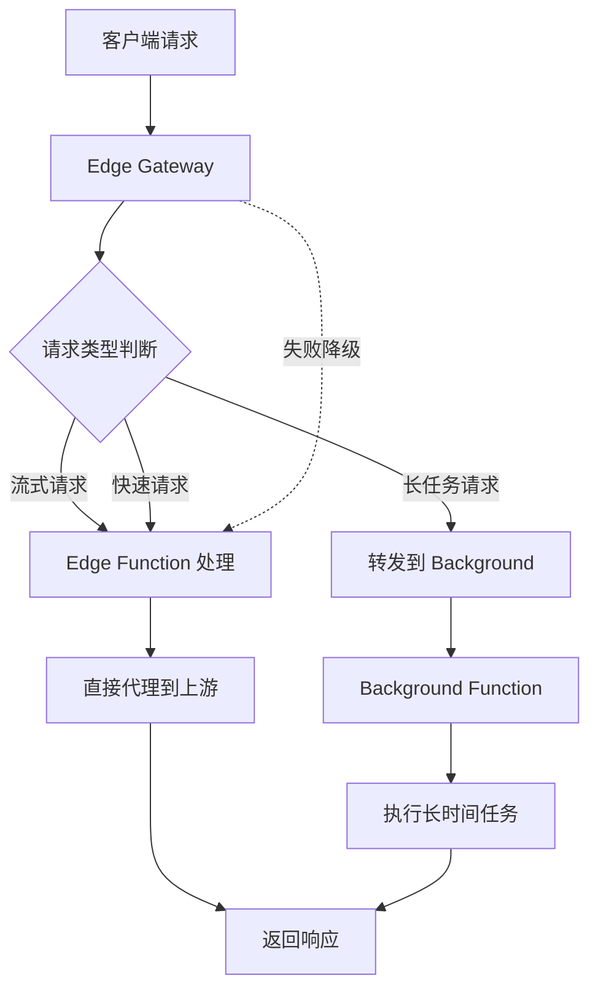

# Vercel API Gateway for LLM Services

一个高性能的混合 API 网关，专为 AI/LLM 服务设计，结合 Vercel Edge Functions 和 Serverless Functions 的优势。

## ✨ 核心特性

### 🚀 双运行时架构
- **Edge Functions**: 处理快速响应和流式请求（SSE），20 秒超时限制
- **Serverless Functions**: 处理长时间任务，支持最长 5 分钟执行
- **智能路由**: 自动识别请求类型并路由到最优运行时

### 🔄 智能请求处理
- **流式响应支持**: 完美支持 SSE（Server-Sent Events）和流式 API
- **自动重试机制**: 带指数退避的智能重试
- **降级策略**: Background 失败自动降级到 Edge 处理
- **大文件处理**: 自动识别大请求并路由到 Background

### 🛡️ 安全与监控
- **请求头过滤**: 自动过滤敏感和不必要的请求头
- **响应大小限制**: 防止超大响应导致的问题
- **完整的请求追踪**: 每个请求都有唯一 ID 便于调试
- **详细日志记录**: 分级日志系统（DEBUG/INFO/WARN/ERROR）

### 🌍 支持的 AI 服务

| 服务 | 域名 | 流式支持 | 说明 |
|------|------|---------|------|
| OpenAI | api.openai.com | ✅ | GPT-3.5/4, DALL-E, Whisper |
| Anthropic Claude | api.anthropic.com | ✅ | Claude 3 系列 |
| Google Gemini | generativelanguage.googleapis.com | ✅ | Gemini Pro/Ultra |
| Azure AI | models.inference.ai.azure.com | ✅ | Azure OpenAI Service |
| Groq | api.groq.com | ✅ | 超快速推理 |
| Cohere | api.cohere.ai | ✅ | Command, Embed |
| HuggingFace | api-inference.huggingface.co | ⚠️ | 开源模型 |
| Together AI | api.together.xyz | ✅ | 开源模型聚合 |
| SiliconFlow | api.siliconflow.cn | ✅ | 国内优化 |
| GitHub Models | models.github.ai | ✅ | GitHub AI 模型 |

## 🚀 快速开始

### 1. 一键部署到 Vercel

[](https://vercel.com/new/clone?repository-url=https://github.com/ssfun/vercel-llm-gateway)

### 2. 手动部署

```bash
# 克隆项目
git clone https://github.com/ssfun/vercel-llm-gateway.git
cd vercel-llm-gateway

# 安装依赖
npm install

# 配置环境变量
cp .env.example .env
# 编辑 .env 文件

# 本地开发
npm run dev

# 部署到 Vercel
npm run deploy
```

### 3. 环境变量配置

在 Vercel Dashboard 或 `.env` 文件中配置：

```env
# 基础配置
ALLOWED_ORIGIN=*                    # CORS 允许的源
DEFAULT_TIMEOUT=20000               # Edge 默认超时（毫秒）
BACKGROUND_TIMEOUT=240000           # Background 超时（毫秒）
MAX_RESPONSE_SIZE=6291456          # 最大响应大小（字节）
ENABLE_RETRY=true                   # 启用重试
ENABLE_FALLBACK=true                # 启用降级
LOG_LEVEL=INFO                      # 日志级别

# 自定义代理配置（可选）
PROXY_CONFIG='{"custom":{"host":"api.custom.com"}}'
```

## 📖 使用指南

### 基础请求格式

```
https://your-domain.vercel.app/gateway/{service}/{path}
```

### 示例请求

#### OpenAI Chat Completion（非流式）

```bash
curl -X POST https://your-domain.vercel.app/gateway/openai/v1/chat/completions \
  -H "Content-Type: application/json" \
  -H "Authorization: Bearer sk-..." \
  -d '{
    "model": "gpt-3.5-turbo",
    "messages": [
      {"role": "system", "content": "You are a helpful assistant."},
      {"role": "user", "content": "Hello!"}
    ]
  }'
```

#### OpenAI Chat Completion（流式）

```bash
curl -X POST https://your-domain.vercel.app/gateway/openai/v1/chat/completions \
  -H "Content-Type: application/json" \
  -H "Authorization: Bearer sk-..." \
  -H "Accept: text/event-stream" \
  -d '{
    "model": "gpt-3.5-turbo",
    "messages": [{"role": "user", "content": "Write a story"}],
    "stream": true
  }'
```

#### Claude Messages API

```bash
curl -X POST https://your-domain.vercel.app/gateway/claude/v1/messages \
  -H "Content-Type: application/json" \
  -H "x-api-key: sk-ant-..." \
  -H "anthropic-version: 2023-06-01" \
  -d '{
    "model": "claude-3-opus-20240229",
    "messages": [{"role": "user", "content": "Hello Claude!"}],
    "max_tokens": 1024
  }'
```

#### Google Gemini

```bash
curl -X POST https://your-domain.vercel.app/gateway/gemini/v1beta/models/gemini-pro:generateContent \
  -H "Content-Type: application/json" \
  -H "x-goog-api-key: ..." \
  -d '{
    "contents": [{
      "parts": [{"text": "Explain quantum computing"}]
    }]
  }'
```

#### 健康检查

```bash
# 网关健康检查
curl https://your-domain.vercel.app/gateway/health

# 返回示例
{
  "status": "ok",
  "timestamp": "2024-01-01T00:00:00.000Z",
  "service": "api-gateway",
  "mode": "edge",
  "version": "1.0.0",
  "env": "production"
}
```

## 🏗️ 架构设计

### 请求处理流程



### 智能路由规则

| 请求类型 | 处理方式 | 条件 |
|---------|---------|------|
| GET/HEAD/OPTIONS | Edge | 所有情况 |
| 流式请求 | Edge | `stream=true` 或 SSE |
| 小请求体 POST | Edge | < 1MB |
| 大请求体 POST | Background | > 1MB |
| 音频/图像生成 | Background | 特定 API 路径 |
| Embeddings | Background | `/v1/embeddings` |
| 文件操作 | Background | `/v1/files` |

## 🛠️ 高级配置

### 添加自定义服务

在环境变量 `PROXY_CONFIG` 中添加：

```json
{
  "myservice": {
    "host": "api.myservice.com",
    "basePath": "v1",
    "timeout": 30000,
    "maxRetries": 3,
    "retryableMethods": ["GET", "POST"],
    "defaultHeaders": {
      "X-Custom-Header": "value"
    },
    "supportsStreaming": true,
    "allowFallback": true
  }
}
```

### 自定义重试策略

修改 `api/_shared/middleware.ts`:

```typescript
// 自定义重试条件
const retryableErrors = ['timeout', 'network', 'connection'];

// 自定义退避策略
const baseDelay = Math.min(100 * Math.pow(2, attempt), 5000);
const jitter = baseDelay * 0.3 * (Math.random() - 0.5);
```

### 调整超时设置

```env
# Edge Function 超时（最大 20 秒）
DEFAULT_TIMEOUT=15000

# Background Function 超时（最大 300 秒）
BACKGROUND_TIMEOUT=300000
```

## 📊 性能优化

### Edge Function 优化
- **超时设置**: 20 秒（避免触发 25 秒硬限制）
- **流式响应**: 立即返回响应头，避免超时
- **请求克隆**: 避免重复读取请求体

### Background Function 优化
- **长任务支持**: 最长 5 分钟执行时间
- **内存配置**: 1024MB 内存分配
- **并发处理**: 自动扩展处理并发请求

### 网络优化
- **智能重试**: 指数退避 + 抖动
- **连接复用**: Keep-Alive 连接
- **响应压缩**: 自动 gzip 压缩

## 🔍 监控与调试

### 请求追踪

每个请求都有唯一的 Request ID：

```bash
# 响应头中包含
X-Request-Id: uuid-xxxx-xxxx
X-Processing-Mode: edge|background
X-Processing-Time: 1234
```

### 日志查看

在 Vercel Dashboard 的 Functions 标签页查看实时日志：

```
[2024-01-01 12:00:00.000] [req-id] [INFO] Gateway 收到请求 | method=POST path=/gateway/openai/v1/chat/completions
[2024-01-01 12:00:00.100] [req-id] [DEBUG] 路由决策 | decision=edge reason=Streaming request
[2024-01-01 12:00:01.000] [req-id] [INFO] Edge 请求完成 | status=200 duration_ms=1000
```

### 错误处理

统一的错误响应格式：

```json
{
  "error": {
    "message": "错误描述",
    "type": "TIMEOUT|NETWORK|DNS|CONNECTION|SSL|SIZE_LIMIT|UNKNOWN",
    "request_id": "uuid-xxxx",
    "timestamp": "2024-01-01T00:00:00.000Z"
  },
  "status": 500
}
```

## 🚨 故障排除

### 常见问题

#### 1. Edge Function 超时
- **问题**: 请求在 25 秒后超时
- **解决**: 确保长任务被正确路由到 Background Function

#### 2. CORS 错误
- **问题**: 浏览器报告 CORS 错误
- **解决**: 检查 `ALLOWED_ORIGIN` 环境变量设置

#### 3. 413 错误
- **问题**: 响应大小超过限制
- **解决**: 调整 `MAX_RESPONSE_SIZE` 环境变量

#### 4. 重试过多
- **问题**: 请求重试次数过多导致延迟
- **解决**: 调整 `maxRetries` 配置或禁用重试

## 📝 开发指南

### 本地开发

```bash
# 启动开发服务器
npm run dev

# 类型检查
npm run lint

# 格式化代码
npm run format
```

### 项目结构

```
vercel-llm-gateway/
├── api/
│   ├── _shared/           # 共享模块
│   │   ├── config.ts      # 配置管理
│   │   ├── types.ts       # 类型定义
│   │   ├── logger.ts      # 日志系统
│   │   ├── utils.ts       # 工具函数
│   │   ├── errors.ts      # 错误处理
│   │   └── middleware.ts  # 中间件
│   ├── gateway.ts         # Edge Gateway 主入口
│   └── background.ts      # Background Function
├── public/
│   └── index.html         # 欢迎页面
├── package.json
├── vercel.json           # Vercel 配置
├── tsconfig.json         # TypeScript 配置
└── README.md
```

## 🤝 贡献

欢迎提交 Issue 和 Pull Request！

### 贡献指南

1. Fork 项目
2. 创建功能分支 (`git checkout -b feature/AmazingFeature`)
3. 提交更改 (`git commit -m 'Add some AmazingFeature'`)
4. 推送到分支 (`git push origin feature/AmazingFeature`)
5. 提交 Pull Request

## 📄 许可证

MIT License - 详见 [LICENSE](LICENSE) 文件

## 📮 联系

- GitHub: [@ssfun](https://github.com/ssfun)
- Issues: [GitHub Issues](https://github.com/ssfun/vercel-llm-gateway/issues)

---

**⭐ 如果这个项目对你有帮助，请给个 Star！**
